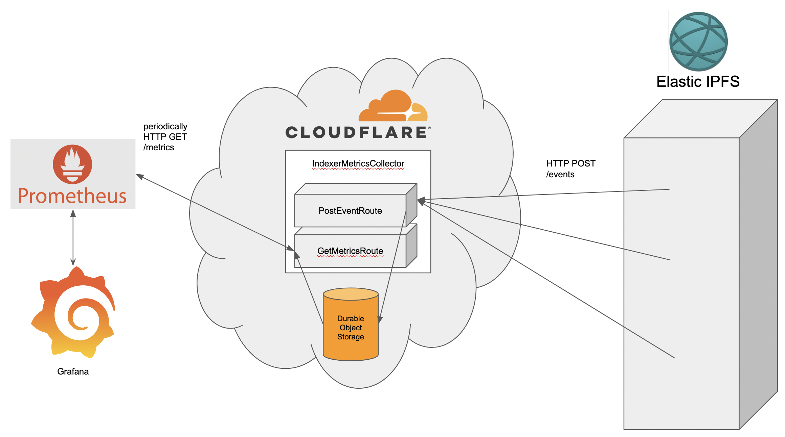

# metrics-collector

metrics-collector collects events about what happens inside [elastic-ipfs](), calculates some metrics from that event stream, and then makes those metrics available in a way they can be [scraped by prometheus](https://prometheus.io/docs/prometheus/latest/configuration/configuration/#scrape_config).

More about the motivation to make this can be found in [Elastic Provider Events](https://hackmd.io/7FHjMKZ2TgGycAvapvBqqw).

<!-- https://docs.google.com/presentation/d/19ZuzApQ6y6-2-5TchJcaIXwzeJ0IFGQbEY2XnMLiTI8/edit?usp=sharing -->

## What

### [indexer-events](./src/indexer-events/)

Schemas for event types that describe the elastic-ipfs indexing process

### [indexer-metrics-collector](./src/indexer-metrics-collector)

Web server that can receive indexer-events over HTTPS

### [prom-client-serializer](./src/prom-client-serializer/)

Tools for serializing/deserializing [prom-client](https://www.npmjs.com/package/prom-client) metrics so they can be persisted to a k/v store by indexer-metrics-collector.